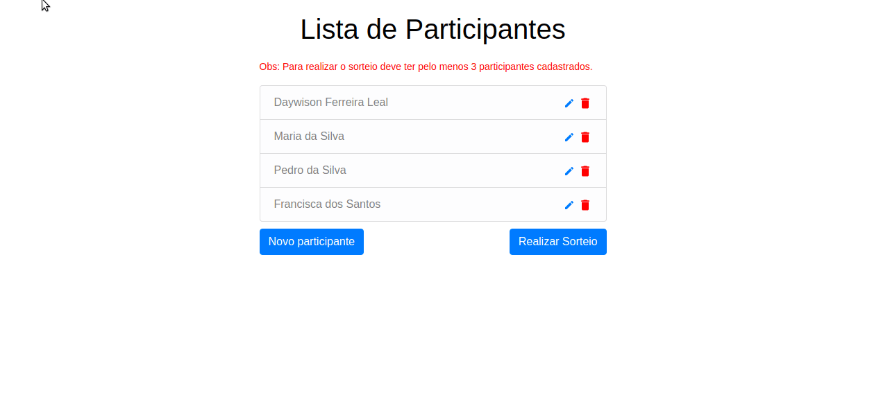

<p align="center">
<a href="#about">About</a>&nbsp;&nbsp;&nbsp;|&nbsp;&nbsp;&nbsp;
  <a href="#technologies">Technologies</a>&nbsp;&nbsp;&nbsp;|&nbsp;&nbsp;&nbsp;
  <a href="#how-to-install-and-start">How to install and start</a>
</p>


## About
Project carried out for the selection process at Adireto

---

##  Technologies
Technologies used:

### Backend:
-  [Node.js](nodejs)
-  [Mongoose](https://mongoosejs.com/)
-  [Express](https://expressjs.com/pt-br/)
-  [MongoDB](https://www.mongodb.com/)
-  [Mailtrap](https://mailtrap.io/) ( _mail service_ )

### Frontend:
-  [ReactJS](https://reactjs.org/)
-  [React Bootstrap](https://react-bootstrap.github.io/)

## Link to access the application
- [Teste Adireto](https://teste-adireto-frontend.herokuapp.com/)

## How to install and start

```bash

  # Clone this repository
  $ git clone https://github.com/DaywisonFerreira/test-ad-2020.git

  $ cd backend

  # Change the settings for the .env.example variable to enter the database credentials
  # and credentials mail server

  # Install dependencies
  $ yarn install

  # Run server
  $ yarn start

  ## Front end
  $ cd frontend

  # Install dependencies
  $ yarn install

  # Run
  $ yarn start


  ```

  ----
### Made with :heart: by Daywison Leal
-  [LinkedIn](https://www.linkedin.com/in/daywison-leal/)


